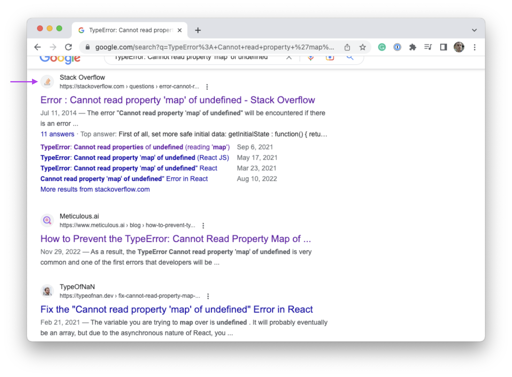

# Googling

It may surprise you to learn that "googling" is a skill on its own. It is common practice for software developers to regularly be scouring the internet for answers to their coding questions.

In this guide, you'll learn why software developers use search engines and how to do it effectively. While this skill is generally referred to as "googling," you can use any search engine you prefer.

## Why search?

Software development is an endlessly complex and challenging field of study and industry. The variety of tools and tasks is one reason why many developers enjoy working with code. However, it is an industry unlike many others in that it is impossible to remember everything.

This is often true of many science and math-related industries. As a software developer, your job is to solve problems with code -- not to memorize every bit of syntax you see. While memorization of specific syntax and functions can make your work quicker, it is something that will come with time.

As you'll learn from your instructors and others in the industry, googling is common practice when you forget a particular syntax or can't remember what a particular function does. There's no shame in this.

For more on this topic, watch the following video which describes the search history of a high-paid senior engineer.

- [The Google History of a High-Paid Sr. Engineer](https://www.youtube.com/watch?v=LW9pT246LrI)

## Searching in this class

In this class, you will be expected to attempt to solve problems on your own through searching. Your instructors may also suggest you google issues before asking for help. As a software developer, you will need a certain level of self-sufficiency to succeed in the industry.

With that said, you should google _to understand_, not just to get an answer. For example, imagine in the course of building a user interface for an in-class project, you come across the following error with some code you've written.

```
TypeError: Cannot read property 'map' of undefined'
```

If you're not sure what this means, you are free to google this error explicitly. Read through the responses until you find something that helps you fix your code. However, you should not just copy and paste some code you find on the internet without inspecting it. Not only will it not help you solve your problem, but you also won't learn anything from that process.

## Where to search for help

As you google various code issues, you'll find that there are many websites out there that claim to have answers. You will need to be a bit discerning when clicking on links to find a website result that can truly be useful.

As you are getting started, it is recommended that you stick to the following websites when googling.

- [Stack Overflow](https://stackoverflow.com)
- [Mozilla Developer Network (MDN)](https://developer.mozilla.org/)
- [GitHub](https://github.com)

When you use the Google website, you'll be able to see which website you're going to by looking at the logo and URL next to the result.



If you are unable to find help on those websites, you then may want to move on to blog posts and other help sites.
